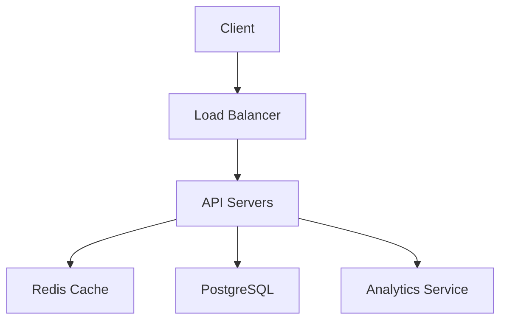

# Architecture Overview

## High-Level Architecture

## Core Components

1. **API Layer**

   - Express.js REST API
   - Rate limiting
   - Authentication/Authorization
   - Request validation

2. **Caching Layer**

   - Redis for URL mappings
   - Analytics data caching
   - Rate limiting data

3. **Database Layer**

   - PostgreSQL with Prisma ORM
   - Stores user data, URLs, and analytics

4. **Services**
   - URL Service: URL creation and retrieval
   - Analytics Service: Click tracking and statistics
   - Auth Service: User authentication and authorization

## Key Features

- URL shortening with custom aliases
- Comprehensive analytics
- User authentication
- Rate limiting
- Caching
- API documentation with Swagger
