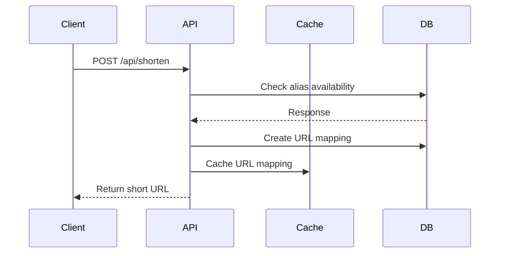
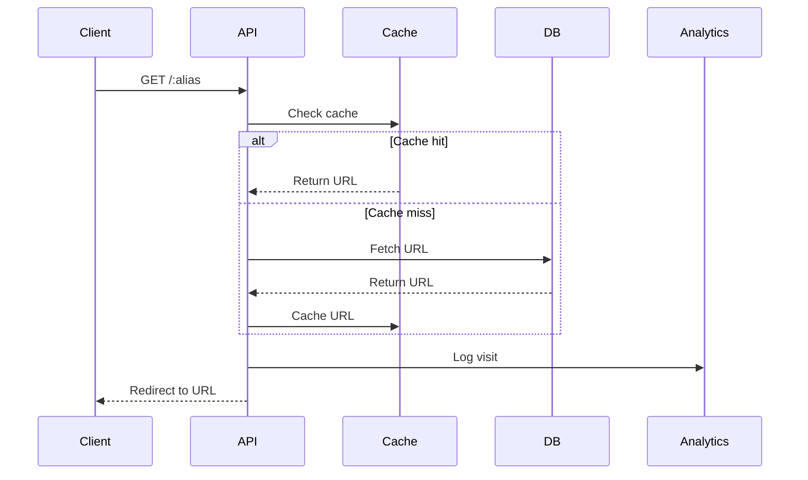

# System Design

## Directory Structure

```
src/
├── config/         # Configuration files
├── controllers/    # Route handlers
├── middleware/     # Express middleware
├── models/         # Data models
├── repositories/   # Database access layer
├── routes/         # API routes
├── services/       # Business logic
└── utils/         # Helper functions

docs/              # Documentation
tests/             # Test files
```

## Flow Diagrams

### URL Shortening Flow



### URL Redirection Flow


